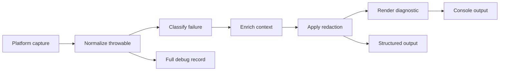

# Stackframe project design

## What Stackframe is

Stackframe is a server-side diagnostics mod for Minecraft. Its job is to convert
exceptions and error log events into a consistent message that helps a server
operator answer four questions quickly:

1. What failed?
2. Where did it fail?
3. Why did it fail?
4. What can I do next?

The presentation is inspired by `rustc`: a short title, a stable diagnostic
code, relevant context, cause notes, and practical help. Stackframe is not a
general log theme and must not rewrite ordinary informational output.

The initial platform is Fabric. Forge support comes after the loader-independent
API has been proven by the Fabric implementation.

## Product principles

### Readability without information loss

The console should show the most useful facts first and collapse low-value
internal frames. The complete original throwable, including suppressed
exceptions and causal chains, must still be written to a configured debug log or
structured diagnostic record.

### Safe degradation

Known failures can receive specialized explanations. Unknown failures must still
produce a generic but valid diagnostic. If Stackframe itself cannot format an
event, it must emit the original event unchanged and report its own failure
separately. A formatting bug must never hide a server error.

### Operator-focused output

Messages should use server concepts such as world, mod, configuration, registry,
network connection, or resource pack where evidence supports that wording.
Stackframe must not guess at a cause or blame a mod without sufficient evidence.

### Loader-independent core

Capture is platform-specific; diagnostics are not. Minecraft, Fabric, and later
Forge adapters translate platform events into a stable internal model. The
classifier and renderer depend only on that model.

### Automation-friendly behavior

Color is optional, plain text remains readable, redirected output is detected,
and a structured format is available for hosting panels and log processors.

## Diagnostic format

A terminal diagnostic has these sections:

```text
error[SF2003]: datapack validation failed
  --> world/datapacks/example.zip
   |
 12 | "type": "minecraft:unknown"
    |         ^^^^^^^^^^^^^^^^^^^ unknown registry value
   |
   = cause: no registry entry matches "minecraft:unknown"
   = help: check the identifier and whether its providing mod is installed
   = trace: 22 internal frames collapsed; full trace written to debug log
```

- **Severity:** error, warning, or note.
- **Code:** stable identifier suitable for search and documentation.
- **Title:** one sentence describing the failed operation.
- **Location:** a file, mod, resource, configuration key, phase, or source frame.
- **Context:** a bounded excerpt when it is safe and useful.
- **Labels:** annotations tied to exact context.
- **Cause notes:** ordered facts derived from the causal chain.
- **Help:** evidence-based remediation, never an unsupported guess.
- **Trace summary:** collapsed-frame count and location of full details.

Diagnostics must also have a plain representation and a versioned structured
representation. Renderers consume the same model so their meaning cannot drift.

## Processing pipeline



### 1. Capture

The Fabric adapter observes eligible error events at supported integration
points. Capture must avoid recursive logging, preserve event ordering, and not
interfere with unrelated appenders. Duplicate observations of the same failure
are correlated before rendering.

### 2. Normalize

The normalizer traverses causes and suppressed exceptions with cycle detection
and explicit depth limits. Wrapper exceptions are retained in raw data but may
be de-emphasized in the operator view. Frames are tagged as Minecraft, loader,
mod, JDK, library, or unknown without discarding them.

### 3. Classify

Classifiers match typed exceptions and verified event attributes before falling
back to message patterns. Each classifier returns its confidence and evidence.
A low-confidence match cannot name a responsible mod or offer destructive help.

Diagnostic code ranges should remain stable:

| Range | Area |
| --- | --- |
| `SF0xxx` | Stackframe and generic fallback |
| `SF1xxx` | Server lifecycle and startup |
| `SF2xxx` | Data, resources, registries, and worlds |
| `SF3xxx` | Mods, mixins, and dependencies |
| `SF4xxx` | Networking and players |
| `SF5xxx` | Storage, permissions, and environment |

### 4. Enrich

Enrichers resolve mod metadata, map source frames, and load bounded source or
configuration excerpts. Enrichment has time and size budgets. Files outside
approved server paths are not read merely because an exception mentions them.

### 5. Redact

Secrets, access tokens, addresses, player identifiers, and configured path
segments are redacted before operator or structured output. The policy must be
documented and testable. Raw debug output follows an explicit, separate policy.

### 6. Render

The renderer calculates layouts from display width rather than string length,
supports nested causes, and has deterministic wrapping. ANSI styling is enabled
only when supported or explicitly requested. `NO_COLOR` and the Stackframe
configuration always take precedence over automatic detection.

### 7. Preserve

The original throwable is retained in a full debug record. Stackframe should
eventually support a short correlation ID so the console diagnostic, structured
record, and full trace can be connected without repeating the entire stack.

## Proposed modules and dependency direction

```text
stackframe-core
  diagnostic model, normalization, classifiers, enrichment contracts

stackframe-renderer
  depends on core; terminal, plain-text, and JSON renderers

stackframe-fabric
  depends on core and renderer; lifecycle and logging integration

stackframe-testkit
  shared exception fixtures, fake platform metadata, golden-file helpers
```

Platform modules may depend on core, but core cannot import Fabric, Forge,
Minecraft, Log4j, or platform-specific metadata types.

## Configuration

The initial configuration should cover:

- output mode: `auto`, `ansi`, `plain`, or `json`;
- verbosity and stack-collapse policy;
- full-trace destination and retention;
- redaction options;
- diagnostic include/exclude rules;
- deduplication window;
- optional development diagnostics.

Configuration errors are diagnostics themselves. Invalid values must not be
silently replaced without telling the operator which value was rejected.

## Compatibility boundaries

Stackframe must coexist with hosting panels, redirected stdout, existing Log4j
configuration, crash-report generation, and other mods that install appenders.
It should not parse or rewrite already-rendered lines when a typed event is
available. Platform internals are isolated behind small adapters and covered by
integration tests against each supported Minecraft and loader version.

## Performance and reliability

Formatting runs on bounded data and must not retain throwable graphs after an
event is written. Expensive enrichment is cached or deferred where safe.
Backpressure behavior must be explicit: preserve severe events and fall back to
unformatted logging rather than blocking the server indefinitely.

The formatter needs recursion guards, deterministic limits, and metrics useful
in development builds. Snapshot tests cover visual output; property and fixture
tests cover malformed, cyclic, deeply nested, and unusually large exceptions.

## Delivery plan

### Foundation

Establish Gradle, Java and Minecraft support policy, modules, the diagnostic
model, renderers, fixtures, and CI. Define compatibility and output contracts
before integrating deeply with a loader.

### Fabric MVP

Capture real server failures, normalize causal chains, render readable output,
preserve complete traces, provide configuration, and validate common startup,
world, registry, mixin, and mod dependency failures.

### Production readiness

Add redaction, JSON output, performance limits, compatibility tests,
troubleshooting documentation, release artifacts, and observability for
Stackframe's own failures.

### Forge

Extract lessons from Fabric into a stable platform SPI, implement Forge capture
and metadata adapters, and run the same contract fixtures for both loaders.

## Non-goals for the first release

- Replacing every normal server log line.
- Hiding or deleting original stack traces.
- Automatically editing configuration or world data.
- Uploading diagnostics to an external service.
- Assigning blame based only on the first non-Minecraft stack frame.
- Supporting client-only crashes.

## Definition of a successful MVP

The MVP is successful when representative Fabric server failures render as
bounded, readable diagnostics; unknown failures degrade safely; full details can
be recovered; color and plain output are equivalent in meaning; and integration
tests prove that Stackframe does not swallow or duplicate error events.
