# Roadmap

Stackframe is delivered in five dependency-ordered milestones. The
[GitHub roadmap board](https://github.com/orgs/MinecraftProt/projects/1) is the
live status view; this document records the intended outcomes and release gates.

## Critical path

```mermaid
flowchart LR
    A[Support policy and license] --> B[Gradle modules]
    B --> C[Diagnostic model]
    C --> D[Throwable normalization]
    D --> E[Classifier arbitration]
    E --> F[Terminal renderer]
    F --> G[Fabric capture]
    G --> H[Fabric integration matrix]
    H --> I[Fabric alpha]
    I --> J[Production hardening]
    J --> K[Loader SPI]
    K --> L[Forge alpha]
    L --> M[Client scope and privacy contract]
    M --> N[Fabric client alpha]
    N --> O[Forge client adapter]
```

Work outside this path can proceed in parallel when its input contracts are
stable. A milestone does not close merely because code exists; all exit criteria
must be demonstrated.

See [DEPENDENCIES.md](DEPENDENCIES.md) for parallel execution waves and the
starter queue.

## M0 - Foundation

**Outcome:** a reproducible, loader-independent diagnostics foundation with a
testable rendering contract.

### Workstreams

- **Project baseline:** support policy (#2), Gradle modules (#7), license (#8),
  and CI (#4).
- **Core contracts:** diagnostic model (#6), throwable normalization (#1),
  classifier confidence and conflict resolution (#41), and code registry (#5).
- **Readable output:** terminal renderer (#3), message and accessibility rules
  (#42), and golden fixtures (#9).

### Exit criteria

- A clean checkout builds with the documented Java toolchain.
- Core has no Fabric, Forge, Minecraft, or logging implementation dependency.
- Cyclic and hostile throwable fixtures terminate with bounded output.
- ANSI and plain output carry equivalent meaning.
- Diagnostic codes, evidence, fallback, and writing rules are documented.
- The approved license permits contributions and distribution.

## M1 - Fabric MVP

**Outcome:** an installable Fabric server mod that safely transforms important
failures and always preserves their complete technical details.

### Workstreams

- **Integration:** safe Fabric capture (#10), full traces and correlation (#13),
  deduplication (#21), configuration (#14), and runtime inspection (#15).
- **Core diagnostics:** mod dependencies (#12), Mixin failures (#18), worlds and
  registries (#20), network binding (#38), filesystem failures (#44), and Java
  runtime or memory failures (#35).
- **Context and presentation:** terminal detection (#11), bounded enrichment
  (#19), and source mapping (#39).
- **Proof:** Fabric server matrix (#17), Log4j/crash-report/hosting compatibility
  (#16), and the first Fabric alpha (#34).

### Exit criteria

- Supported Fabric server failures enter the pipeline exactly once.
- A Stackframe failure emits the original error unchanged.
- Complete causes, suppressed exceptions, and frames are recoverable.
- Unknown errors produce a useful generic diagnostic.
- Configuration errors identify the rejected value and preserve prior settings.
- Dedicated-server tests pass across the published support matrix.
- Installation, limitations, trace recovery, and bug reporting are documented.

## M2 - Production readiness

**Outcome:** a bounded, private-by-default, automation-friendly Fabric release
with sustainable maintenance and support processes.

### Workstreams

- **Safety:** redaction (#27), formatting budgets and backpressure (#25),
  self-diagnostics (#32), hostile-input testing (#43), and supply-chain checks
  (#37).
- **Operations:** JSON/NDJSON output (#30), sanitized support bundles (#36),
  public compatibility matrix (#45), and representative mod testing (#24).
- **Ecosystem:** diagnostic extension API (#40), localization strategy (#46),
  diagnostic catalog (#33), and release automation (#29).

### Exit criteria

- Secrets and protected values are redacted across every renderer and bundle.
- Error storms cannot block the server indefinitely or lose severe events.
- Structured output has a versioned schema and one valid record per event.
- Release artifacts have checksums, provenance, dependency, and license data.
- Compatibility claims name exact versions and evidence.
- Every stable diagnostic code has searchable operator guidance.

## M3 - Forge support

**Outcome:** a Forge server artifact using the same diagnostic semantics and
safety contracts as Fabric.

### Workstreams

- Stabilize the loader platform SPI (#26).
- Implement Forge capture (#22) and metadata/classifiers (#23).
- Run cross-loader contract tests (#28).
- Package and publish the first Forge alpha (#31).

### Exit criteria

- Shared diagnostic codes mean the same thing on Fabric and Forge.
- Loader-specific types remain within platform modules.
- Both adapters pass generic fallback and full-trace preservation contracts.
- Exact Forge and Minecraft versions are published in the compatibility matrix.
- Fabric behavior does not regress as a consequence of SPI extraction.

## M4 - Client support

**Outcome:** a separately packaged client edition that presents client failures
with the same bounded, evidence-based diagnostic language as the server edition.

### Workstreams

- **Contract:** define client scope, UX, artifact, threading, and privacy
  boundaries (#63).
- **Fabric platform:** bootstrap the client module (#60), capture client failures
  safely (#61), and add specialized client diagnostics (#65).
- **Presentation:** build an accessible in-game diagnostic and crash view (#62).
- **Proof and release:** create a Fabric client matrix (#66) and publish the first
  Fabric client alpha (#59).
- **Forge later:** implement the Forge client adapter after the shared SPI and
  Forge server contracts stabilize (#64).

### Exit criteria

- The client artifact is separate and cannot be confused with the server artifact.
- Fabric client startup, runtime, resource reload, disconnect, and crash failures
  preserve original logs and crash reports.
- The in-game view is keyboard accessible, narrated, scale-aware, redacted, and
  has a plain fallback when rendering is unavailable.
- Compatibility claims name exact Minecraft, Java, loader, operating-system, and
  relevant graphics assumptions.
- Client data such as account identifiers, chat, server addresses, screenshots,
  clipboard contents, and local paths follows an approved privacy contract.
- Forge client support reuses the shared SPI and diagnostic meanings rather than
  duplicating Fabric client internals.

## Scope control

New work enters the earliest milestone whose exit criteria require it. Moving an
issue earlier requires a dependency or release-safety reason, not only
convenience. Moving work later requires updating affected exit criteria and
documenting the resulting limitation.

The first server releases do not rewrite normal log lines, edit server data,
upload diagnostics automatically, or handle client-only crashes. Client-only
failures are reserved for M4 and its separate artifacts.
